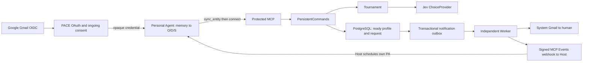

# 系统结构与数据流

## 组件与边界

PACE 是通过 MCP 暴露业务契约的 Personal Agent Connection Backend。PA 根据自己的记忆整理用户画像；PACE 原样校验、持久化 O/D/S，用 Jev 匹配，并向被匹配者的平台回调和 Gmail 分别通知。PA 的记忆读取与实际运行权限属于 Host，PACE 不构建记忆、不读远端文件、不调用 LLM 提炼 Ontology。当前完成度见 [STATUS](STATUS.md)，本轮决策见 [ADR 0004](decisions/0004-pa-profiles-and-event-hosts.md)。

| 层 / 入口 | 职责 | 约束 |
| --- | --- | --- |
| domain | 可信 Principal、Snapshot、选择值、Gmail 规范化、同意版本、安全错误 | 无 ORM / SDK / transport 依赖 |
| application | 持久命令、完整画像契约、版本绑定、Tournament、Port | 不创建 SDK 或读取 Key；即时 Request 不写长期 D/S |
| adapters/db | 事务、资格、快照、outbox、租约与通知持久状态 | 不实现 MCP 协议，不推断画像 |
| adapters/auth | Google OIDC、Account、PACE OAuth 状态 / 凭据 | 身份不能来自 Tool 参数 |
| adapters/providers | Jev 结构选择、输入预算与协议转换 | 不决定候选资格或写 Match |
| adapters/delivery | Capture、系统 Gmail、签名 webhook | 外部接受不等于用户阅读或 PA 已运行 |
| interfaces | 官方 MCP transport、Events 扩展、OAuth、HTTP 运维、Worker CLI | 固定两项业务 Tool |
| bootstrap | 具体 Adapter、生产 Handler、资源生命周期 | 不自动迁移、联网验收或消耗模型额度 |

## Gmail 与一次授权

[ADR 0003](decisions/0003-gmail-identity.md) 规定个人 `@gmail.com` 与 Google 签名 `sub` 双唯一。dot / plus alias 规范到同一 Gmail；跨 Host 使用相同 Gmail 与 sub 关联同一 Account UUID。冲突或禁用账号不自动合并 / 恢复。没有独立邮箱注册表单。

首次接入通过 PACE 同意页与 Google 登录完成账号创建及持续授权：PA 在安装初始化及每次连接前自动上传整理的 O/D/S、PACE 保存并向 Jev 提供画像进行匹配、成功匹配披露相关信息与 Gmail，同时投递平台事件和人类邮件。PACE 不增加逐次上传确认；Host 的记忆、工具及监控权限仍须按平台配置，安装或 PACE 同意不能覆盖它们。再次在不同 Host 绑定时按该 Host OAuth 流程授权，仍使用同一 Account。

同意版本为 `pa-connections-v2`；旧同意不能自动扩大范围，旧账号必须重新走同意 / Google 流程。每次验证与业务操作重查当前同意版本和启用资格。Google 只申请 openid/email，不读邮箱；系统发件账号另用 gmail.send。

官方 MCP auth 路由处理注册、redirect、scope、PKCE。DCR 只接受运营者配置的精确 URI 或受限单段 callback_id 模板；注册时持久化精确 URI，授权阶段仍由 SDK 精确校验，见 [ADR 0005](decisions/0005-oauth-callback-id-templates.md)。浏览器 flow 绑定 HttpOnly / SameSite cookie；Google 使用独立 state、nonce、PKCE，回跳验证签名、issuer、audience、时效、nonce、azp、email_verified 和 Gmail 域。flow 一次性消费，失败不能复用。

PACE 签发独立 opaque access / refresh，Hash 持久化，绑定注册 client 和固定 `/mcp` resource。码一次性消费，refresh 轮换令旧族凭据失效，撤销作用于同族。客户端 secret、Google verifier、webhook secret 用持久 Fernet Key 加密。发现需相关 scope，sync_entity 要 pace:sync，connect 与 Events 要 pace:connect。

## 连接前同步与初始化

安装阶段完成 OAuth 与平台事件订阅；**安装授权与事件订阅后，PA 先 sync 初始化入池**。每次新 connect 都由 PA 先重新整理完整画像并 sync，连接后和事件接收时不更新，不定时同步。

1. 锁已验证且接受当前同意的 Account，同账号同步串行。相同 account/request_id 与相同载荷重放原回执；不同载荷冲突。重放先于 expected_entity_version 判断。
2. PA 提交完整 ontology 文本、demands / supplies 文本列表。三者全部必填，完整替换，空值明确清除；后端不合并、不总结、不把即时请求推断为长期意图。
3. 完整 O/D/S 文本预算为 4000 UTF-8 bytes，每个列表最多 20 个不重复、非空白条目。让 PA 在预算内保留尽量多的匹配证据、日期与硬约束；过长明确拒绝，不由后端静默裁剪。Jev 的整体输入预算仍独立检查。
4. 内容变化就增加版本并追加 `pa-entity-v1` EntityVersion；原样内容保持版本。当前 Entity、快照与 SyncReceipt 同事务提交，回执立即 ready，没有构建队列或后端 LLM。
5. 新操作更新 Entity.updated_at 作为最近接受同步时间；同键重放仍返回原回执、不假装进行新同步。全空画像可以保存，但不参与匹配。

当前资料、历史快照、回执和通知任务均存 PostgreSQL，O/D/S 是 JSONB 中的文本 / 列表，没有向量库或图数据库。EntityVersion.created_at 是内容版本产生时间，Entity.updated_at 是最近新同步接受时间。旧 files / sources / model 列保留兼容历史，不再采集或读取旧文件；旧 LLM 快照必须由 PA 重新同步才可使用。原 schema 仍为 0003，没有重写迁移或自动删除历史数据。

## 持久 connect

1. 以 account/request_id advisory 事务锁串行相同操作，避免并发重复选择。当前资格先检查；相同成功回执在仍有权披露时原样重放，失败同载荷可重试，不同载荷冲突。
2. 请求者使用当前、非空、直接发布的完成快照。必填 entity_version 必须等于刚同步的版本；过期在模型调用前报 version_conflict。服务端版本检查不能证明远端 PA 确实读取了最新记忆，此步骤由 skill 约定。
3. 候选必须有已验证未过期 / 未撤销的 connection.matched 订阅，并为每账号当前版本，排除自己、空画像、旧 LLM 格式及不满足 Google Gmail / 当前同意 / 启用条件的账号。候选池超限明确报 selection_limit，不静默截断。
4. Tournament 每组 1–4 个真实候选 + no_match，稳定分组、同轮有限并发、逐轮淘汰。零候选零模型调用；单候选仍需判断。组内概率不能作为全局成功率；并列含 no_match 时保守淘汰。错误不伪装为 No Match。
5. Provider 错误留下 Request.failed / 安全 code，提交后抛错。有效 No Match 保存回执，不生成 Match 或通知。
6. 匹配提交前固定 ID 顺序锁双方并重新检查资格及快照仍为当前，保存唯一 Match、双方快照引用与最小联系人信息。相关信息仅取最多四条请求词命中片段，不附送全画像或伪造 Jev 理由。
7. 同事务生成 connection_id / event_id、email.send 及每个有效订阅的 event.deliver。回执记录提交时状态，不随交付变化改写。

完整画像替换会撤销旧版本的后续披露：旧 matched 回执和待发送通知会重新检查双方版本，任一变化就拒绝旧披露。即便新增事实也采取这一保守规则；原样同步不会阻断。历史记录仍保存，这不是删除接口。模型调用期间事务有总时间预算，但会占用 DB 连接；尚不是高并发最终实现。

## Events 与 Gmail 两通道

MVP 面向能接收外部事件并运行用户 PA 的平台，目标为 ChatGPT Work 网页 / 桌面 Cloud 和 dots。使用同一 [官方 MCP Events webhook 契约](https://developers.openai.com/plugins/build/mcp-events)，不做不支持平台的轮询、邮箱唤醒或自建调度适配；这些目标仍需真实账号验收。PACE 发送事件给 Host，Host 根据订阅指令调度自己的 PA；PACE 不远程启动进程，不保证收到 webhook 后 PA 一定执行。

被匹配方收到 `connection.matched` 后只通知本人，MVP 没有 A-to-A、回信通道或双方 Agent 对话。系统 Gmail 独立发送给已验证的人类邮箱。订阅更新 / refresh 维持回调可用，不是 Ontology 定时同步。

官方 SDK 尚无公开 Events 方法回调，因此隔离扩展只接管 events/list、subscribe、unsubscribe，官方 SDK 继续处理发现和 Tools。启用 Event Adapter 才追加 events capability。订阅键由可信 account/client、callback、event、canonical arguments 决定；官方退订使用原 name / arguments / delivery URL。只有 connection.matched、空过滤参数，无 replay。

签名 challenge 回显通过才激活，secret 加密，轮换短期双签。challenge / 投递仅公网 HTTPS443，每次 DNS 校验拒绝非公网，固定 IP 保留 TLS SNI，禁重定向与环境代理。eventId 重试不变，签名时间更新；410/413 撤销并终止。平台负责在 refreshBefore 前刷新订阅。

两种任务分别执行与记录状态；发送前重查双方资格、当前快照及订阅有效性。邮件失败不取消 Events，Events 失败不阻挡邮件。没有有效订阅的账号不进入候选，选择提交前再次检查，失效不能降级为仅邮件。新匹配两通道均 queued；not_subscribed 保留用于历史结果或所有订阅终止后的状态。

Gmail API 返回 provider_accepted，事件 2xx 返回 accepted_by_receiver，都不等于阅读 / PA 执行。至少一次执行中，外部接受后 DB 确认前崩溃可能重复；Message-ID 仅追踪，接收端按 eventId 去重。资格检查与网络投递不跨网络原子化。

## Worker 与运维

业务写入与 outbox enqueue 共用事务，同 dedupe_key 同 kind / payload 重放，不同载荷冲突。JobQueue 以 SKIP LOCKED 领取、lease UUID / 截止时间续租与确认，旧持有者不能完成接管任务。心跳丢失取消执行，有限退避，终止通知错误不重试。

独立 Worker 只注册 email.send / event.deliver，API 不拉起 Worker。旧 ontology.build 任务没有 Handler，明确失败并按已有有限重试结束，不再调用模型。run_once=True 仅表示领过任务。Worker 轮询自己的任务队列属于后端交付，不是轮询 PA 或定时同步画像。

[插件包](../plugins/pace/plugin.json) 提供 DCR OAuth 声明、安装 setup skill 和连接 skill；部署改私有打包副本的 MCP URL。setup 帮助建立平台原生事件监控，不能声称安装包会自动获得订阅。API lifespan 管理 SDK / DB 资源。readyz 检查 Google / Jev / Events / Gmail 配置与 DB revision，不依赖后端 LLM，不调用付费服务、不证明 Worker 与外部凭据有效。操作见 [DEVELOPMENT](DEVELOPMENT.md)。

## 初期部署拓扑

部署模板将 API、Worker 与独立 PostgreSQL 分为三个 Docker Compose 服务；数据库仅在容器网络内开放，API 通过宿主机 loopback 8010 接入 Nginx。Nginx 终止 HTTPS，以 clawcrony.com 为 origin，并提供公开首页、隐私说明与条款。生产私有配置独立于本机开发配置；部署不会证明 Google 登录、真实事件或邮件验收通过，实际状态见 [STATUS](STATUS.md)。
