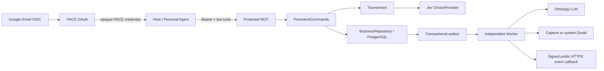

# 系统结构与数据流

## 组件与边界

PACE 是平台无关的连接后端。Host 负责得到文件读取 / 上传授权，提交实际文本与即时请求；后端负责已验证 Gmail 账号、Entity 快照、候选选择及通知。Worker 只能处理已提交文本，不能代替 Host 读取远端文件。完成度与外部验收缺口统一见 [STATUS](STATUS.md)。

| 层 / 入口 | 职责 | 禁止跨越 |
| --- | --- | --- |
| domain | Principal、Snapshot、选择值、Gmail 规范化、安全错误 | 不依赖 ORM / SDK / transport |
| application | 持久命令编排、D/S 显式更新规则、淘汰赛、Port 与契约 | 不创建 SDK 或读取 Key |
| adapters/db | SQL 事务、资格过滤、快照映射、outbox、任务持有权与 Handler 持久状态 | 不实现 MCP 协议 |
| adapters/auth | Google OIDC、账号关联、PACE OAuth 状态 / 凭据 | 不接受 Tool 提供的身份 |
| adapters/providers | Jev 结构选择、LLM 事实提取 | 不决定候选资格或写 Match |
| adapters/delivery | Capture、系统 Gmail、加密签名 webhook | 接受不等于用户阅读 |
| interfaces | 官方 MCP transport、隔离 Events 扩展、OAuth 浏览器入口、运维 HTTP、Worker CLI | 不另建第三项业务 Tool |
| bootstrap | 配置选择具体 Adapter、注册生产 Handler、资源生命周期 | 构造不自动调用远端服务或迁移 |

## Gmail 与跨平台身份

[ADR 0003](decisions/0003-gmail-identity.md) 明确只使用个人 `@gmail.com`，不支持 Workspace 自定义域、其它邮箱或未经验证的 email 字符串。点号和 plus alias 规范到同一 Gmail；Google 签名 `sub` 同时作为强身份绑定。相同邮箱与 sub 在不同 Host 关联同一 Account UUID；冲突或禁用账号不自动合并 / 恢复。

官方 MCP auth 路由处理客户端注册、redirect、scope 和 PACE PKCE。每个 Host 的授权先显示 PACE 同意页，再进入 Google。浏览器 flow 绑定 HttpOnly / SameSite cookie；Google 使用独立 state、nonce 和 PKCE，仅申请 openid/email。回跳验证签名、issuer、audience、时效及 nonce、azp、email_verified 和 Gmail 域。一次性 flow 在 Google 验证前原子消费，失败不能复用。

PACE 不把 Google bearer 传给 MCP。签发独立 opaque access / refresh，数据库只保留 SHA-256 索引，绑定注册 client 和固定 `PUBLIC_BASE_URL/mcp` resource。授权码一次性消费；refresh 轮换使旧族 access / refresh 失效；撤销同族凭据。每次验证重新检查账号资格。客户端 secret、Google verifier、webhook secret 用外部 Fernet Key 加密。

MCP 入口至少需要一项相关 scope；sync_entity 要求 pace:sync，connect 与 Events 要求 pace:connect，发现受认证保护。来源授权和联系方式披露同意不是同一权限：上传范围由 Host 明确获得，注册披露 / Gmail 通知由 PACE 同意页获得。

## 同步与 Ontology 发布

1. 根据 Principal 锁定已验证账号。同账号同步串行；回执查找先于版本检查。
2. 相同 account/request_id + 相同规范载荷返回原回执；不同载荷冲突。expected_entity_version 不等于当前接受版本则拒绝。
3. files=null 保留完整授权集；files=[] 清除；非空 files 替换完整集合。D/S 只处理明确 upsert/remove，两个命名空间分别使用稳定 entry_id。
4. 增加 Entity 接受版本。若只有 D/S 更新且基底是当前已完成版本，直接追加完成快照，复用 O，零 LLM。否则实体进入 building/refreshing，原子入队 ontology.build 并保存 SyncReceipt。
5. Worker 调模型前检查任务版本，过时 / 已完成任务直接退出。空来源集清空 O，零 LLM。非空来源重新提取事实，每行保留 source_id 标签，不由旧画像补回已撤销文件。
6. 提交时加锁再查当前版本。仍然最新才追加 EntityVersion，保存 O/D/S、来源 metadata、model/prompt_version 并切换 ready。失败只标记仍对应当前版本的 Entity，旧完成快照继续存在；撤销来源后，含撤销来源的旧快照不能再进入匹配或新的通知披露。

未完成 Entity 不参与选择；旧完成快照只有其所有来源仍在当前授权集合内才可使用。EntityVersion 在用例中只追加，DB 没有历史不可变 Trigger；原始完整来源保存在当前 Entity 与任务 payload，来源 metadata 并不等于完整审计 / 保留体系。

## 持久 connect

request_text + context 是即时 Request，永远不自动写进长期 Demand。

1. 使用 account/request_id 的稳定 advisory 事务锁，防止并发重放重复计费。
2. 校验请求者资格；已成功请求在双方与来源仍获授权时原结果重放，载荷变化冲突，已失败同载荷可以重试。
3. 请求者必须有完成快照。候选取各账号最新已完成 EntityVersion；排除自己与没有 Google Gmail / 验证 / 同意 / 启用的账号。
4. 候选池查询有界；超出配置上限明确报 selection_limit，不静默截断。选择有整体时间预算。
5. Tournament 每组最多四个真实候选 + no_match，稳定顺序、同轮有限并发、逐轮淘汰。零候选零模型调用；单个候选仍需与 no_match 判断。概率只在本组内比较；并列包含 no_match 时保守淘汰，否则稳定 ID 决胜。错误取消剩余选择，不伪装为 No Match。
6. 模型错误写 Request.failed / 安全 code，等事务提交后抛错。有效 No Match 保存原回执，无 Match / 通知。
7. 匹配时按固定 ID 顺序锁双方并重新加载资格，防止选择期间撤销后仍披露联系方式；同时重新检查历史快照引用的来源仍获授权。保存唯一 Match、双方完成快照关联与最小联系方式快照。
8. 相关信息来自原文中命中即时请求词的最多四条片段，不附送整幅画像或伪造 Jev 自然语言理由。无相关片段时明确说明资料不足。
9. 同事务生成稳定 connection_id / event_id、email.send 与每个有效订阅的 event.deliver。提交完成才返回 matched。返回回执保存当时 queued/not_subscribed，不跟随通知状态变化改写。

业务事务在有预算的模型调用期间持锁，这为幂等提供简单保证，但占用数据库连接，不是高并发最终设计。UNKNOWN DB / Provider 错误在 Tool 边界返回安全 internal_error，不回显输入或凭据。

## 通知与 Events

请求者在 connect 结果取得对方 Gmail，被匹配方通过系统 Gmail 及其已验证 Host 订阅接收申请方资料。登录 openid/email 不授权读取用户邮箱，发件通道使用独立系统账号的 gmail.send refresh token。

email.send 先重查双方资格、已保存收件 Gmail与双方快照来源，再投递。capture 原子落盘返回 captured；Gmail API 返回 provider_accepted。Match 邮件状态与事件状态分别维护。外部接受后、DB 确认前崩溃仍可能重复 Gmail 发送；Message-ID 仅稳定追踪，不能承诺 exactly-once。

MCP SDK 没有公开 Events 回调，所以隔离扩展层只接管 events/list、subscribe、unsubscribe；官方 SDK 继续处理发现和 Tools。仅启用 Event Adapter 时，在官方发现响应追加 events capability。遵循 [官方 MCP Events 说明](https://developers.openai.com/plugins/build/mcp-events)。

订阅键来自可信 account/client + callback + event + canonical arguments。当前仅 connection.matched、空过滤参数、无 replay。订阅进行签名 challenge，收到常数时间一致的 challenge 回显才激活；secret 加密，刷新替换 secret 时短期双签。

challenge 与投递都只允许公网 HTTPS 443；每次解析 DNS，拒绝任一非公网结果，连接固定已验证 IP，保留原 Host / TLS SNI，禁重定向和环境代理。响应与请求都有上限。eventId 跨重试不变，签名时间每次更新；410/413 撤销订阅并终止任务。

投递前重查双方账号、历史快照来源、订阅期限与撤销。Match 记录每个订阅的独立状态，聚合时失败不被其它成功掩盖；全部终止 / 过期不表示已经收到。检查和网络副作用不是跨网络原子操作，接收端必须按 eventId 去重。

## 队列与通用 Worker

业务写入和 enqueue 共用调用者事务。dedupe_key 全局唯一；同 kind/payload 重放旧任务 ID，不同载荷冲突。

JobQueue 使用 SKIP LOCKED 原子领取，attempts+1，生成 lease UUID 和截止时间。renew / complete / fail 同时检查 running、ID、当前 lease、未过期；旧 Worker 不能确认被接管任务。心跳每 lease_seconds/3 续租；失去占有权取消执行。未知 kind 明确失败；安全错误码及有限指数退避，终止通知错误不重试。

Worker 是独立进程，bootstrap 注册 ontology.build、email.send、event.deliver；API 不自行拉起 Worker。run_once 的 True 只表示领过任务，不证明成功。至少一次副作用仍要求 Handler / 接收者幂等。

## Host 接入与运维

plugins/pace 包含 portable manifest、MCP 地址、连接 skill 和显式本地文件 collector。collector 不扫描目录、不联网、拒绝越界 / 外部 symlink，只输出实际选中的 UTF-8 TXT/Markdown 与原样 hash。远端文件仍由 Host connector 读取。connect 完成后 Host 再收集授权范围并 sync；没有假装 Worker 已自动刷新文件。

API lifespan 启动官方 SessionManager，退出同时关闭 DB / Provider 资源；一个关闭失败不会跳过其它清理。缺配置可提供 healthz/contracts，但业务明确失败。readyz 检查 DB revision 与配置，不调用付费服务、不保证 Worker 或外部凭据可用。操作方法见 [DEVELOPMENT](DEVELOPMENT.md)。
