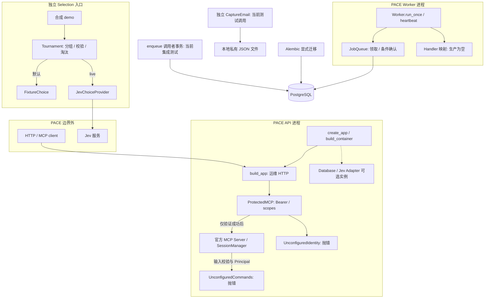
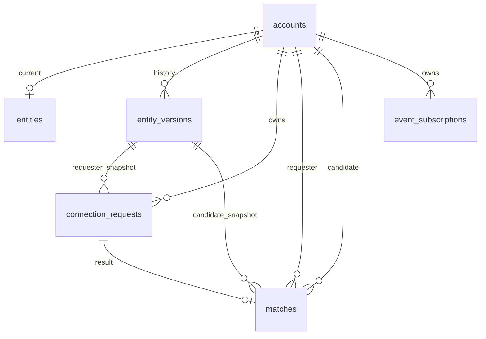
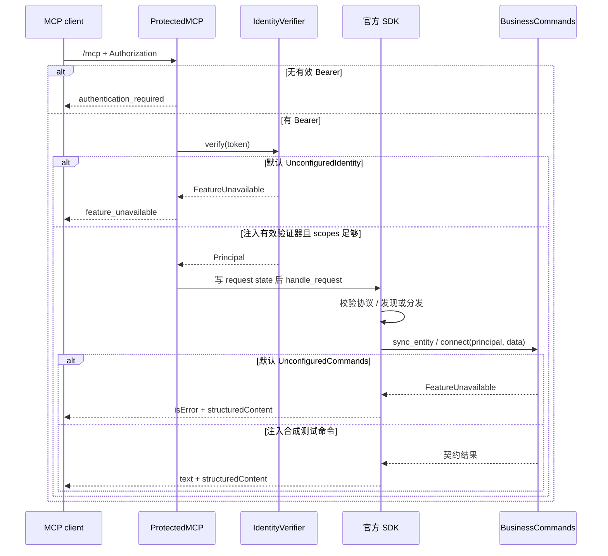
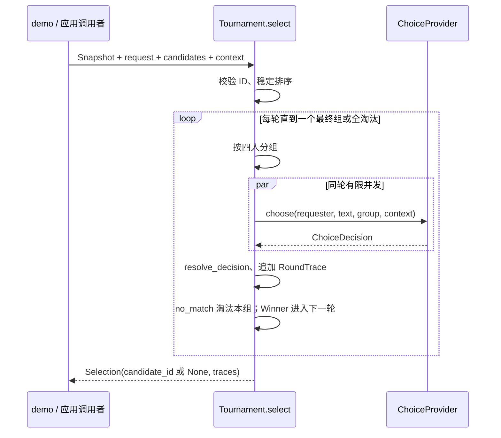
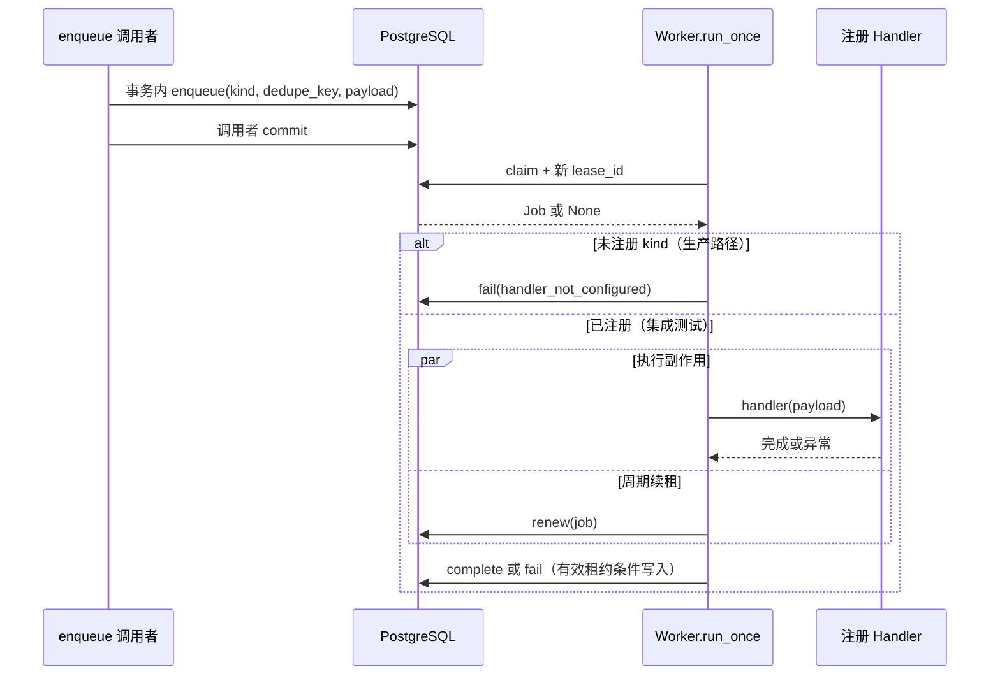

# 当前架构

本文描述工作区源码实际形成的结构。模块完成度统一见 [STATUS](STATUS.md)，文件 / symbol 导航见 [CODEMAP](CODEMAP.md)，字段与协议规则见 [INTERFACES](INTERFACES.md)。架构取舍见 [ADR-0002](decisions/0002-code-framework.md)；历史 MVP 取舍见 [ADR-0001](decisions/0001-mvp-baseline.md)。

## System boundary 与组件

PACE 包含一个 Python 包及 PostgreSQL schema，API 与 Worker 为独立进程。Host / Personal Agent、授权文件来源、Jev 服务和 LLM / 邮件服务位于边界外。当前仓库没有 Host / Platform adapter；文件契约接收 Host 已读取的文本，后端不会读取远端文件或下载任意 URL。Account 表和 Principal 类型定义身份数据边界，但不构成身份系统。

| 组件 | 当前职责与依赖方向 |
| --- | --- |
| `domain` | 标准库数据值：Principal、EntitySnapshot、Selection 与安全错误；不依赖 transport / ORM / SDK |
| `application` | Pydantic 契约、Protocol 能力边界、Tournament 编排；Commands 的默认实现明确失败 |
| `adapters` | ORM / Session / jobs、TypeSafe SDK 转换、本地 Email 捕获；没有 Ontology / Event 真实 Adapter |
| `interfaces` | HTTP 运维与 MCP 身份入口、官方 SDK 回调、独立 Worker 执行与续租 |
| `bootstrap` | API 集中选择具体身份 / Commands / DB / Jev 实例；配置 DB / Key 只构造资源，不产生业务调用 |

下图实线是当前调用或读写；虚线是已构造但未接入业务的资源。独立 demo 与 API 业务命令没有调用连接。

`ProtectedMCP` 的默认路径在 Identity 处停止；只有显式注入有效验证器后才进入 SDK。SDK 回调访问 `BusinessCommands`，默认命令仍停止。没有从 API Command 到 Tournament、数据库写入或 Worker 入队的生产链，因而图中不画这类箭头。

## 核心对象与关系

`Principal(user_id, scopes)` 是可信身份值，保存在请求级 ASGI state，作为命令的单独参数。`SyncEntityInput` 表达文件与显式长期 D/S 变更；`ConnectInput` 表达独立即时 Request 和时间 / 地点上下文，二者不共享隐式长期写入规则。

`EntitySnapshot` 是 Selection 的文本 O 与 D/S 元组。`ChoiceDecision` 是单组选择；`RoundTrace` 记录该组候选 ID、原始 decision 与并列规则后的 winner；`Selection` 仅返回候选 UUID 或 None，**不是数据库 Match**。域 Snapshot 的 ontology 是 str，ORM Entity 的 ontology 是 JSONB，当前没有生产转换函数。

存储关系由已存在的外键决定，字段与约束只在 [INTERFACES](INTERFACES.md#database) 维护：

`jobs` 是独立基础设施表，无业务表外键，payload 未强制关联业务对象。ORM 没有声明 relationship；图表示 schema 外键关系，不表示已经存在对象加载或业务流程。Snapshot 所属账号的一致性与合法状态转换不由图中的外键保证。

## Runtime flows

### API 启动、MCP 与失败边界

`create_app` → `build_container` → `build_app`。FastAPI lifespan 在官方 SessionManager 的 run 上下文中运行，退出时调用 Container.close；启动不建表、不测试网络、不启动 Worker。运维端点独立于 MCP 身份校验，具体响应见 [HTTP reference](INTERFACES.md#httpapi)。

测试注入只证明 transport 与应用边界接线。生产无账号登录 / OAuth endpoint，不能用 Tool 字段声明身份；exact scope 与 HTTP 错误见 [MCP reference](INTERFACES.md#mcp-tools)。

### 独立 Selection / Jev

调用者提供 requester Snapshot、即时文本、候选 Snapshot 与可选 context。Tournament 在 Provider 调用前拒绝重复 ID / 自身，按 UUID 字符串稳定排序；零候选直接返回空 traces 和 None。每轮划分为至多四人一组，单组选择规则的已接受原因见 [ADR-0001](decisions/0001-mvp-baseline.md)。

即使最终只有一个人也要与 no_match 比较；最后一个组判断后即返回，不再无限循环。同轮调用失败时取消其余未完成任务并传播原错误。每次 select 自建 Semaphore，跨请求并发会叠加。

Jev Adapter 将 O/D/S 当证据，构造 request/context、requester、candidate state 与候选 ID / no_match criteria，调用官方 SDK。返回概率仅在该组有效；Tournament 验证概率集合、总和与最大项，按稳定并列规则决定 winner。Provider 超时 / 输入预算 / 错误映射见 [External services](INTERFACES.md#external-services)。整个流程不写 Request / Match，也不生成联系人摘要。

### 队列与通用 Worker

`enqueue` 在调用者事务内去重，不 commit。`claim` 在独立事务中先终止耗尽尝试且过期的 running 任务，再以 SKIP LOCKED + UPDATE RETURNING 领取到期 queued 或过期 running 任务；领取增加 attempts 并生成新 lease UUID。

租约失效使 heartbeat 抛错，Worker 取消执行；异常以稳定 code 记录。副作用完成后、DB 确认前崩溃可重新执行，保障是至少一次。当前代码不把失败的确认布尔值转为额外状态；详见 [STATUS 技术债](STATUS.md#current-technical-debt)。

### Event / Email 与 Ontology 的当前边界

ConnectionMatched、EventSubscription、OntologyBuilder、EventDelivery 是数据 / 接口边界，没有生产触发者。CaptureEmail 是独立开发 Adapter，落盘返回 captured；不进入 Match / Worker 链。`ConnectResult.ontology_refresh` 提供 Host 重新收集提示，但没有 Host 执行器或后台刷新实现。不能从这些 schema 推导实际通知、Email 验证或 Ontology 已更新。
